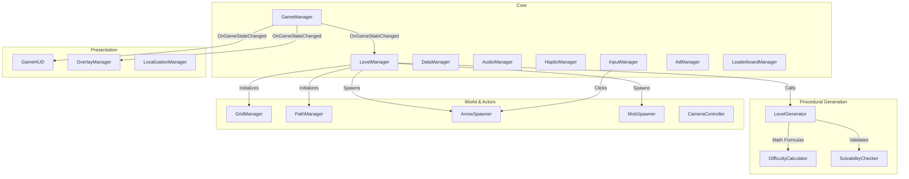
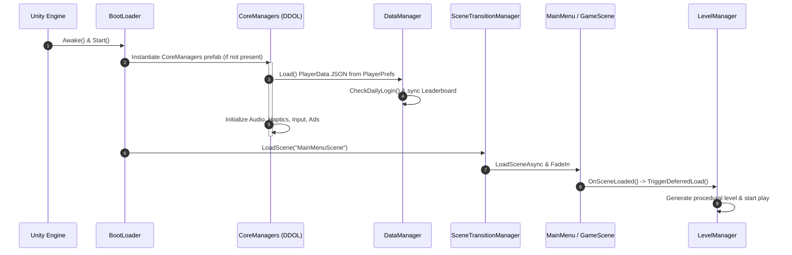
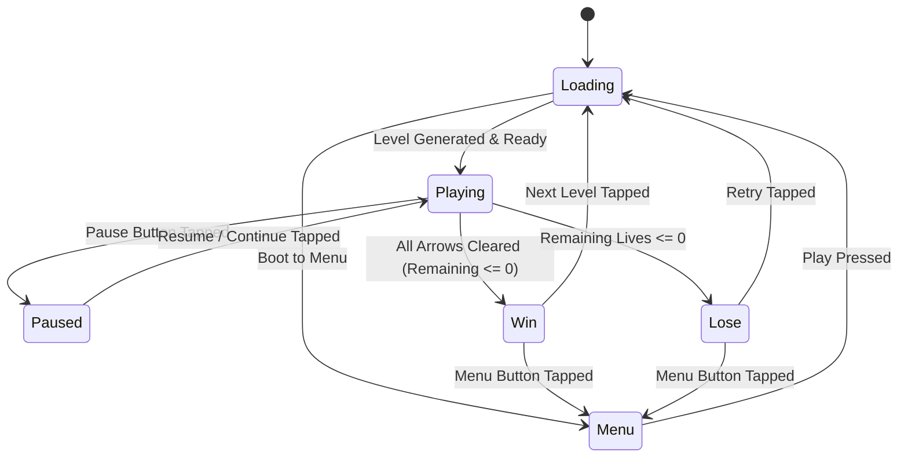
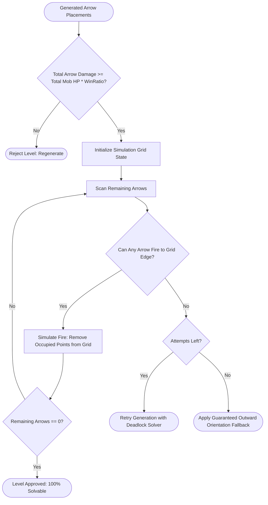
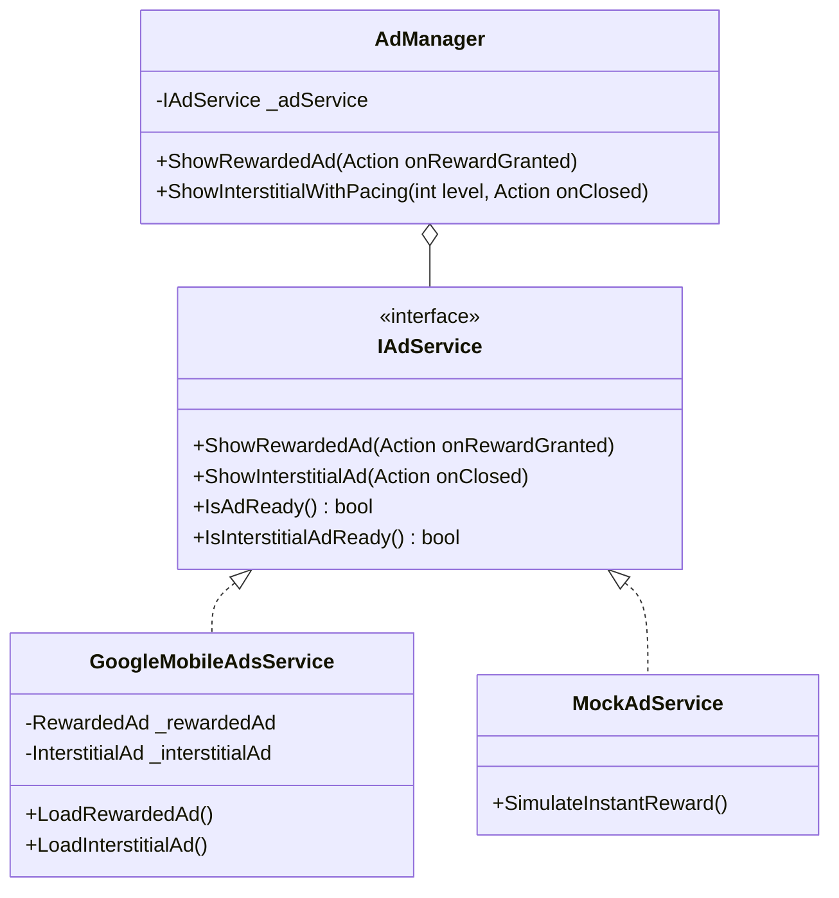
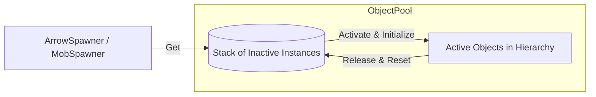

# Arrow Swarm — Technical Architecture & Engine Anatomy Document

> **Comprehensive Technical Master Reference Manual**  
> *Target Audience: Senior Game Engineers, Software Architects, Technical Directors, QA Leads, and Systems Integrators.*  
> *Project Version: Unity 6 (6000.3.18f1) URP 2D | Target Platform: Android Portrait (1080x1920)*

---

## Table of Contents
1. [Project Overview](#1-project-overview)
2. [Technology Stack & Environment](#2-technology-stack--environment)
3. [Project Directory Anatomy](#3-project-directory-anatomy)
4. [High-Level Architecture & Design Principles](#4-high-level-architecture--design-principles)
5. [System Dependency Map & Communication Topology](#5-system-dependency-map--communication-topology)
6. [Initialization & Startup Pipeline](#6-initialization--startup-pipeline)
7. [Core Game Loop & State Machine](#7-core-game-loop--state-machine)
8. [Scene Architecture & Scene Build Pipeline](#8-scene-architecture--scene-build-pipeline)
9. [Input System & Multi-Touch Filtering](#9-input-system--multi-touch-filtering)
10. [Procedural Level Generation & Mathematics](#10-procedural-level-generation--mathematics)
11. [Solvability & Winability Simulation Engine](#11-solvability--winability-simulation-engine)
12. [Arrow Subsystem (Architecture, Flight & Collisions)](#12-arrow-subsystem)
13. [Enemy & Mob Subsystem (Path, Waves & Gap Closing)](#13-enemy--mob-subsystem)
14. [Skills Subsystem (Freeze & Intelligent Hints)](#14-skills-subsystem)
15. [UI/UX Architecture & Two-Canvas Hierarchy](#15-uiux-architecture--two-canvas-hierarchy)
16. [Save/Load Architecture & Profile System](#16-saveload-architecture--profile-system)
17. [UGS Cloud Leaderboard & Offline Cache Pipeline](#17-ugs-cloud-leaderboard--offline-cache-pipeline)
18. [Ad Subsystem & Monetization Architecture](#18-ad-subsystem--monetization-architecture)
19. [Audio Subsystem & Dynamic Modulation](#19-audio-subsystem--dynamic-modulation)
20. [Haptic Feedback Subsystem (Native Android JNI)](#20-haptic-feedback-subsystem)
21. [Localization Engine (Dynamic Multi-Language)](#21-localization-engine)
22. [Camera Subsystem & Multi-Map Framing](#22-camera-subsystem--multi-map-framing)
23. [Object Pooling & Zero-Allocation Memory Strategy](#23-object-pooling--zero-allocation-memory-strategy)
24. [Configuration Data & ScriptableObjects Reference](#24-configuration-data--scriptableobjects-reference)
25. [Exhaustive Script Catalog (88 Scripts Documented)](#25-exhaustive-script-catalog)
26. [Quality Assurance, Edge Cases & Robustness](#26-quality-assurance-edge-cases--robustness)
27. [Technical Debt, Known Issues & Architectural Roadmap](#27-technical-debt-known-issues--architectural-roadmap)
28. [Developer Workflow & Troubleshooting Guide](#28-developer-workflow--troubleshooting-guide)
29. [Glossary of Project Terminology](#29-glossary-of-project-terminology)

---

## 1. Project Overview

**Arrow Swarm** is a minimalist, modern, puzzle-action hybrid game built in Unity 2D with Universal Render Pipeline (URP). The core mechanic revolves around point-based arrow manipulation on an interior grid surrounded by a continuous perimeter mob track.

### 1.1 Gameplay Loop Summary
* **Grid Occupation:** Arrows are snake-like polylines occupying multi-point coordinates on an $N \times M$ point grid. The arrow tip (head) points in one of 4 cardinal directions (Up, Down, Left, Right).
* **Perimeter Track:** Enemies (mobs) spawn in an infinite, continuous queue along a clockwise loop (perimeter path) encompassing the grid.
* **Flight & Piercing:** Tapping an unblocked arrow causes it to launch, traverse through its occupied grid points, exit the board boundary, and travel backward along the perimeter enemy track, dealing damage equal to its weight (number of segments) to mobs in its flight path.
* **Obstacle & Rebound:** Tapping an arrow whose exit path is obstructed causes it to surge forward, strike the blocking arrow with a physical bounce, trigger a red flash/shake feedback, and retreat in reverse back to its resting state. The first obstruction consumes 1 life (Heart); subsequent taps on an already-marked blocked arrow produce a penalty-free wiggle feedback.
* **Dynamic Rainbow Promotion:** When exactly one unfired arrow remains on the board, it is automatically promoted to a **Rainbow Arrow** (rainbow pulsing gradient shader, dealing 999 damage), ensuring a satisfying final crescendo and sweeping the remaining mobs off the track.
* **Zero Static Level Files:** The game features no pre-baked level asset files. Levels are generated on the fly via deterministic procedural algorithms verified by a simulation solvability checker before presentation.

---

## 2. Technology Stack & Environment

| Layer | Technology | Specification / Version |
| :--- | :--- | :--- |
| **Engine** | Unity Engine | `6000.3.18f1` (Unity 6) |
| **Render Pipeline** | Universal Render Pipeline (URP) | `17.3.0` (2D Renderer, Custom Lit/Unlit 2D Shaders) |
| **Target OS / Resolution**| Android Mobile | Portrait Orientation, Reference `1080x1920` (Canvas Scaler: Match Width 1.0) |
| **Input Backend** | New Unity Input System | `com.unity.inputsystem` v1.19.0 (Touchscreen & Mouse pointers) |
| **Text Rendering** | TextMeshPro (TMP) | `com.unity.ugui` v2.0.0 (SDF font assets, dynamic fallback tables) |
| **Backend Services** | Unity Gaming Services (UGS) | Core (`1.18.0`), Authentication (`3.7.4`), Leaderboards (`2.3.4`) |
| **Monetization SDK** | Google Mobile Ads (AdMob) | Rewarded & Interstitial Ad units with official Google test fallback |
| **Haptics** | Native Android JNI | `android.os.VibrationEffect` & `android.os.Vibrator` via JNI fallback |
| **Data Serialization**| Local Storage / PlayerPrefs | JSON serialization with schema validation and self-healing defaults |
| **Language Standards**| C# 9.0 / .NET Standard 2.1 | Static events, Object Pooling, Non-allocating physics raycasts |

---

## 3. Project Directory Anatomy

```
Assets/
├── _Project/
│   ├── Animations/               # Animation clips & controllers for UI/Tutorial
│   ├── Art/                      # 2D Sprites, UI frames, button plates, badges
│   ├── Audio/                    # Audio clips for SFX (clicks, impacts, skills) and BGM loops
│   ├── Data/                     # ScriptableObject runtime instances (SFXLibrary)
│   ├── Devices/                  # Device simulator custom hardware profiles
│   ├── Fonts/                    # TextMeshPro SDF fonts (LilitaOne, Fredoka, Montserrat, CJK fallbacks)
│   ├── Particles/                # Particle System prefabs for arrow impacts & bursts
│   ├── Prefabs/                  # Reusable prefabs (Arrow, Mob, Canvas_HUD, Canvas_Overlay, Popups)
│   ├── Scenes/                   # Game scenes: BootScene, MainMenuScene, GameScene, MapTestScene
│   │   └── Maps/                 # Individual standalone preview scenes (Map1 to Map5)
│   ├── ScriptableObjects/        # GameConfig.asset, MapData assets (Map1.asset through Map12.asset)
│   └── Scripts/                  # Entire C# codebase categorized into 18 functional modules:
│       ├── Ads/                  # AdManager, GoogleMobileAdsService, MockAdService, IAdService
│       ├── Arrow/                # Arrow, ArrowMovement, ArrowVisuals, ArrowCollision, ArrowSpawner
│       ├── Audio/                # AudioManager, SFXLibrary
│       ├── Camera/               # CameraController (smooth framing, pinch-to-zoom, drag)
│       ├── Core/                 # GameManager, LevelManager, LevelGenerator, DifficultyCalculator, SolvabilityChecker
│       ├── Data/                 # DataManager, PlayerData, LeaderboardManager, UnityCloudService, ThemeMode
│       ├── Debug/                # DebugManager, AdminManager, SolvabilityTester
│       ├── Editor/               # Custom inspectors, BootSceneBuilder, MCPAutoConnector, LocalizationAutoAttacher
│       ├── Effects/              # ParticleManager, TouchEffectManager, ScreenEffects
│       ├── Grid/                 # GridManager, GridPoint, GridVisualizer, MapContainerVisualizer
│       ├── Localization/         # LocalizationManager, LocalizedText, LanguageDefinition
│       ├── Mob/                  # Mob, MobHealth, MobMovement, MobSpawner, MobVisuals
│       ├── Path/                 # PathManager, PathVisualizer, PathFollower
│       ├── Skills/               # FreezeManager
│       ├── Tips/                 # TipManager, TipHighlighter
│       ├── Tutorial/             # TutorialManager, TutorialHandUI, TutorialOverlayUI
│       ├── UI/                   # MainMenuUI, GameHUD, LevelCompleteUI, GameOverUI, PauseMenuUI, OverlayManager
│       └── Utils/                # Singleton, ObjectPool, Extensions, ProceduralSpriteUtility
├── TextMesh Pro/                 # TMP base assets, shaders, and font materials
└── Plugins/                      # Android JNI plugins and external libraries
```

---

## 4. High-Level Architecture & Design Principles



### Architectural Pillars
1. **Event-Driven Decoupling:** Managers communicate strictly via static C# events (`System.Action`). No manager retains a concrete direct reference to a peer manager unless querying global passive state (`Singleton<T>.Instance`).
2. **Persistent Singleton Infrastructure:** Global services inherit from `Singleton<T>`, which instantiates, names, detaches from hierarchy, and marks them with `DontDestroyOnLoad`. Duplicate components are safely destroyed on scene load.
3. **Pure Logic Procedural Generators:** `DifficultyCalculator`, `LevelGenerator`, and `SolvabilityChecker` are stateless, pure computational classes with zero MonoBehaviour dependencies, enabling seamless unit testing and fast headless simulation.
4. **Scene-First Visuals Rule:** Code does not overwrite static UI layout properties (fonts, anchor offsets, button sprites, base colors) at runtime. Visual identity is configured directly in Unity scenes and prefabs, while scripts only inject dynamic text, numbers, progress meters, and visibility states.

---

## 5. System Dependency Map & Communication Topology

### 5.1 Static Event Catalog

| Event Name | Declaring Class | Signature | Description | Consumers |
| :--- | :--- | :--- | :--- | :--- |
| `OnGameStateChanged` | `GameManager` | `Action<GameState>` | Fired when core state machine transitions | `GameHUD`, `OverlayManager`, `AudioManager`, `InputManager` |
| `OnLivesChanged` | `GameManager` | `Action<int>` | Fired when player life count changes | `GameHUD`, `HapticManager` |
| `OnLevelWon` | `GameManager` | `Action` | Fired when all arrows fire and level is cleared | `OverlayManager`, `AudioManager`, `HapticManager`, `TutorialManager` |
| `OnLevelLost` | `GameManager` | `Action` | Fired when remaining lives drop to 0 | `OverlayManager`, `AudioManager`, `HapticManager` |
| `OnArrowFired` | `GameManager` | `Action` | Fired when an arrow successfully launches | `AudioManager`, `HapticManager` |
| `OnWrongClick` | `GameManager` | `Action` | Fired when player taps an obstructed arrow | `AudioManager`, `HapticManager`, `CameraShake` |
| `OnMobReachedFinish`| `GameManager` | `Action` | Fired when an enemy completes perimeter loop | `AudioManager`, `HapticManager` |
| `OnLevelLoading` | `LevelManager` | `Action<int>` | Fired when level generation begins | `GameHUD` |
| `OnLevelReady` | `LevelManager` | `Action<LevelParams>` | Fired when level grid and paths are fully ready | `GameHUD`, `TutorialManager` |
| `OnArrowCountChanged`| `LevelManager` | `Action<int, int>` | Fired when fired/total arrow count changes | `GameHUD` |
| `OnArrowClicked` | `Arrow` | `Action<Arrow, bool>` | Fired on player click (instance, isSuccess) | `AudioManager`, `ParticleManager` |
| `OnArrowFiredEvent` | `Arrow` | `Action<Arrow>` | Fired when arrow starts moving | `LevelManager`, `ArrowSpawner`, `TutorialManager` |
| `OnArrowCompleted` | `Arrow` | `Action<Arrow>` | Fired when arrow finishes its perimeter run | `ArrowSpawner` |
| `OnAllArrowsFired` | `ArrowSpawner` | `Action` | Fired when 0 active arrows remain | `LevelManager`, `MobSpawner` |
| `OnMobKilled` | `Mob` | `Action<Mob>` | Fired when mob HP reaches 0 | `MobSpawner`, `AudioManager`, `ParticleManager` |
| `OnMobDamaged` | `Mob` | `Action<Mob, int>` | Fired when mob takes damage | `AudioManager`, `MobVisuals` |
| `OnMobFinished` | `Mob` | `Action<Mob>` | Fired when mob reaches end of track | `MobSpawner`, `GameManager` |
| `OnFreezeStarted` | `FreezeManager` | `Action` | Fired when freeze skill activates | `MobSpawner`, `GameHUD`, `AudioManager` |
| `OnFreezeTick` | `FreezeManager` | `Action<float>` | Fired every frame with remaining freeze duration | `GameHUD` |
| `OnFreezeEnded` | `FreezeManager` | `Action` | Fired when freeze skill expires | `MobSpawner`, `GameHUD` |
| `OnNoFreezesAvailable`| `FreezeManager` | `Action` | Fired when freeze skill tapped with 0 charges | `OverlayManager`, `FreezePopupUI` |
| `OnTipUsed` | `TipManager` | `Action<Vector2Int>`| Fired when hint arrow is highlighted | `GameHUD`, `AudioManager` |
| `OnNoTipsAvailable` | `TipManager` | `Action` | Fired when tip tapped with 0 tokens | `OverlayManager`, `TipPopupUI` |
| `OnPlayerDataChanged`| `DataManager` | `Action<PlayerData>`| Fired whenever player save data changes | `GameHUD`, `MainMenuUI`, `AudioManager` |
| `OnLeaderboardUpdated`| `LeaderboardManager`| `Action` | Fired when UGS cloud/cache scores refresh | `LeaderboardUI` |
| `OnLanguageChanged` | `LocalizationManager`| `Action<string>` | Fired when active language code changes | `LocalizedText` (all instances) |

---

## 6. Initialization & Startup Pipeline



### Stage-by-Stage Boot Execution
1. **Scene Index 0 (`BootScene`):**
   * Contains `BootLoader` component.
   * Checks if `GameManager` exists. If not, spawns the `[CoreManagers]` prefab containing: `GameManager`, `DataManager`, `AudioManager`, `HapticManager`, `InputManager`, `AdManager`, `LeaderboardManager`, `TouchEffectManager`, and `LocalizationManager`.
   * Displays smooth loading bar (`BootLoadingUI`) while initializing services.
   * `SceneTransitionManager.Instance.LoadScene("MainMenuScene")` is triggered.
2. **Editor & Direct Scene Bootstrapping (`AutoBootstrapper`):**
   * Uses `[RuntimeInitializeOnLoadMethod(RuntimeInitializeLoadType.BeforeSceneLoad)]`.
   * If a developer presses Play directly inside `GameScene` or `MapTestScene`, `AutoBootstrapper` detects the absence of `GameManager` and automatically instantiates the `CoreManagers` prefab before any `Awake()` or `Start()` calls execute, preventing null reference errors.

---

## 7. Core Game Loop & State Machine

The game loop is strictly governed by `GameState` defined in `ArrowSwarm.Core.GameManager`:

```csharp
public enum GameState
{
    Loading, // Level generation, grid allocation, and path initialization in progress
    Menu,    // Player is in main menu or sub-panels
    Playing, // Active gameplay: input active, mobs moving, arrows interactive
    Paused,  // Game paused: Time.timeScale = 0, audio ducked to 30%, PauseMenu visible
    Win,     // All arrows cleared: mobs swept, LevelCompleteUI displayed
    Lose     // Lives reached 0: input blocked, GameOverUI displayed
}
```



---

## 8. Scene Architecture & Scene Build Pipeline

### Registered Build Scenes (`EditorBuildSettings.asset`)

| Build Index | Scene Asset Path | Primary Purpose | Persistent Objects |
| :--- | :--- | :--- | :--- |
| **0** | `Assets/_Project/Scenes/BootScene.unity` | Engine startup, CoreManager instantiation, splash display | `[CoreManagers]` |
| **1** | `Assets/_Project/Scenes/MainMenuScene.unity` | Home screen, level selection, settings, profile modal, leaderboard | `[CoreManagers]` |
| **2** | `Assets/_Project/Scenes/GameScene.unity` | Primary playable procedural game loop | `[CoreManagers]`, `LevelManager` |
| **3** | `Assets/_Project/Scenes/MapTestScene.unity` | QA & designer testing playground for arbitrary map & parameter testing | `[CoreManagers]`, `MapSceneController` |

### Standalone Design Scenes (`Assets/_Project/Scenes/Maps/`)
* Five dedicated visual staging scenes (`Map1_ForestScene`, `Map2_OceanScene`, `Map3_DesertScene`, `Map4_MountainScene`, `Map5_SpaceScene`) used by environment designers to iterate on URP 2D lighting, background decorations, and color palettes in isolation.

---

## 9. Input System & Multi-Touch Filtering

Located in `Assets/_Project/Scripts/Core/InputManager.cs`. Operates via the New Input System package (`com.unity.inputsystem`).

### 9.1 Touch & Click Validation Pipeline
1. **Drag vs. Tap Discrimination:** 
   Records `_pointerDownPosition`. As the touch moves, distance is evaluated against `MaxTapDistance = 30f` (pixels). If the touch moves greater than 30 pixels, `_isGameplayPressValid` is invalidated. This prevents camera dragging or panning from triggering accidental arrow launches.
2. **UI Bleed-Through Prevention:**
   Executes a dual-layer check:
   * Native `EventSystem.current.IsPointerOverGameObject(touchId)`
   * Manual screen-space graphic raycast using `EventSystem.current.RaycastAll` against all active canvases.
   * If any UI element intercepts the ray, gameplay input is discarded.
3. **Temporal Input Blocking (`BlockInput(duration)`):**
   When scenes transition, panels open/close, or popups dismiss, `BlockInput(0.35f)` sets `_inputBlockedUntilTime = Time.unscaledTime + duration`. This stops click bleed-through from rapid menu dismissals into the newly revealed grid.
4. **Dual-Stage Arrow Detection:**
   * **Primary:** Grid-space mapping via `GridManager.Instance.WorldToPoint(worldPos)` -> finds the exact arrow occupying that grid cell.
   * **Secondary (Fallback):** `Physics2D.RaycastAll(worldPos, Vector2.zero)` querying Arrow colliders for imprecise taps near border cells.

---

## 10. Procedural Level Generation & Mathematics

Procedural generation is executed in pure C# across `DifficultyCalculator.cs` and `LevelGenerator.cs`.

### 10.1 Mathematical Formulas (`DifficultyCalculator.cs`)

#### 1. Difficulty Tier
$$\text{Tier} = \left\lfloor \frac{\text{Level} - 1}{5} \right\rfloor + 1$$

#### 2. Active Map Index (Hierarchy & Override System)
The active map index ($0 \le \text{MapIndex} \le 11$ corresponding to Map 1 through Map 12) is calculated with milestone overrides:
* **Priority 1 (Mega Boss Maze):** For $\text{Level} \ge 100$ where $\text{Level} \pmod{50} = 0 \implies \text{Map 12 (Index 11)}$ (e.g. 100, 150, 200...).
* **Priority 2 (Epic Maze):** For $\text{Level} \ge 50$ where $\text{Level} \pmod{10} = 0 \implies \text{Map 11 (Index 10)}$ (e.g. 50, 60, 70, 80, 90, 110...).
* **Priority 3 (Initial Progression):** For $\text{Level} \le 25 \implies \text{MapIndex} = \left\lfloor \frac{\text{Level} - 1}{5} \right\rfloor$ (5 levels per map for Maps 1 to 5).
* **Priority 4 (Cyclic Rotation):** For $\text{Level} \ge 26 \implies \text{MapIndex} = 5 + (\text{Level} \pmod{5})$ (cycling Maps 6 to 10).

#### 3. Golden Ratio Arrow Max Weight
Each map enforces a strict maximum segment length (weight) to guarantee clear visuals and balanced difficulty:

| Map Index | Map Asset Name | Grid Dimensions | Point Count | Max Weight ($W_{\text{max}}$) |
| :--- | :--- | :--- | :--- | :--- |
| **0** | `Map1.asset` | $6 \times 8$ | 48 | 5 segments (2–6 points) |
| **1** | `Map2.asset` | $7 \times 10$ | 70 | 6 segments (2–7 points) |
| **2** | `Map3.asset` | $8 \times 12$ | 96 | 7 segments (2–8 points) |
| **3** | `Map4.asset` | $9 \times 14$ | 126 | 8 segments (2–9 points) |
| **4** | `Map5.asset` | $10 \times 16$ | 160 | 10 segments (2–11 points) |
| **5** | `Map6.asset` | $11 \times 18$ | 198 | 12 segments (2–13 points) |
| **6** | `Map7.asset` | $12 \times 20$ | 240 | 15 segments (2–16 points) |
| **7** | `Map8.asset` | $14 \times 22$ | 308 | 18 segments (2–19 points) |
| **8** | `Map9.asset` | $16 \times 25$ | 400 | 22 segments (2–23 points) |
| **9** | `Map10.asset` | $18 \times 28$ | 504 | 26 segments (2–27 points) |
| **10** | `Map11.asset` | $20 \times 32$ | 640 | 30 segments (2–31 points) |
| **11** | `Map12.asset` | $25 \times 40$ | 1000 | 35 segments (2–36 points) |

#### 4. Outward Facing Probability
$$\text{Chance}_{\text{outward}} = \max\left(0.25, \, 0.70 - (\text{Tier} - 1) \times 0.01\right)$$

#### 5. Adaptive Map Scale Factor
$$\text{Scale} = 1.0 + 0.55 \times \sqrt{\frac{\max(0, \text{Points} - 48)}{48}}$$

#### 6. Relaxed Perimeter Mob Movement Speed
$$\text{Speed}_{\text{mob}} = \frac{\text{TotalPathLength}}{\text{TargetTransitSeconds}} \quad (\text{Default Target: } 25.0\text{s})$$

### 10.2 Procedural Generation Pipeline (`LevelGenerator.cs`)
1. **Capacity Calculation:** Determines target fill percentage ($75\% \to 95\%$) based on level number.
2. **Self-Avoiding Random Walk:** For each arrow, picks an unoccupied grid seed. Steps randomly in cardinal directions without self-intersecting or overlapping existing arrows until chosen segment length is reached.
3. **Head Orientation:** Assigns head direction favoring outward escape vectors using `Chance_{\text{outward}}`.
4. **Deadlock Solver:** Evaluates arrows in directional clusters. Flips orientations of trapped arrows if their opposite direction yields an unblocked path.
5. **Sanitization Pass:** Scans all generated arrows for self-blocking configurations (where an arrow's head faces its own body segments) and flips or adjusts them.

---

## 11. Solvability & Winability Simulation Engine

Implemented in `Assets/_Project/Scripts/Core/SolvabilityChecker.cs`. Every procedurally generated level must pass this headless simulation before it is deemed playable.



* **Clear Path Check (`CanFireSim`):**
  Steps ray-cast vectors from the arrow's head in its pointing direction:
  $$\vec{p}_{k} = \vec{p}_{\text{head}} + k \cdot \vec{d}_{\text{dir}}$$
  If all points until the grid boundary are absent from the `occupied` coordinate set, the arrow can fire.
* **Guaranteed Solvability Fallback:** If random walk and deadlock solver fail after `MaxRegenerateAttempts` (default 100), `ApplyGuaranteedOutwardOrientation` converts outermost arrows to face boundary edges, mathematically guaranteeing zero soft-locks.

---

## 12. Arrow Subsystem

### 12.1 Script Roles
* **`Arrow.cs`:** Primary actor holding head direction, path points list, weight, rainbow status, and click response logic.
* **`ArrowMovement.cs`:** Manages continuous flight along polyline paths, smooth 90-degree corner interpolation, collision damage triggers, and the blocked rebound sequence.
* **`ArrowVisuals.cs`:** Generates procedural body mesh geometry, positions corner segments, controls head/tail orientation, applies theme palette colors, and coordinates spawn scale-up animations.
* **`ArrowCollision.cs`:** Physics trigger handler applying arrow damage to overlapping enemy mobs during transit.
* **`ArrowSpawner.cs`:** Object pool holder spawning, organizing, and promoting the final arrow to Rainbow mode.

### 12.2 Normal Flight Path Construction
When fired, `ArrowMovement` stitches three distinct path sections into one unified trajectory list:
1. **Resting Body Points:** Tail $\to$ intermediate corners $\to$ Head.
2. **Grid Exit Extension:** Linear projection from head to the nearest outer grid boundary.
3. **Reverse Perimeter Path:** Traversal along the perimeter enemy track in opposite direction to mob movement, maximizing head-on enemy collisions.

### 12.3 Blocked Rebound Sequence
```
[Player Taps Obstructed Arrow]
       │
       ▼
[Surge Forward] -> Moves forward along trajectory up to 1.3x speed toward obstacle
       │
       ▼
[Impact Shake]  -> Reaches collision point, plays ArrowWrong SFX, triggers red flash & camera shake
       │
       ▼
[Slither Back]  -> Reverses velocity, slithers backwards along original points to exact resting position
       │
       ▼
[Mark Blocked]  -> Arrow flagged as IsMarkedBlocked (subsequent taps incur 0 heart loss)
```

---

## 13. Enemy & Mob Subsystem

### 13.1 Script Roles
* **`Mob.cs`:** Coordinates mob lifecycle, state (Alive, Dead, Finished), health access, and visuals.
* **`MobMovement.cs`:** Follows the closed perimeter spline path at `BaseMobSpeed`, handling speed modifiers (Freeze, Gap Close).
* **`MobHealth.cs`:** Manages current/max HP, damage floating numbers, health bar fill, and death triggers.
* **`MobVisuals.cs`:** Handles sprite rendering, hit-flash shaders, death disintegration particle bursts, and freeze tinting.
* **`MobSpawner.cs`:** Continuous stream pool manager. Governs spawn pacing, wave progression, and chain gap-closing.

### 13.2 Event-Driven Backward Gap-Closing
When mobs in a moving line are eliminated, a gap is left in the train. `MobSpawner` detects the gap and dynamically executes smooth chain reformation:
1. Calculates `excessDistance` between the severed front group and the trailing queue.
2. Applies a negative speed ($-\text{BaseSpeed} \times \text{GapCloseMultiplier}$) to the front group.
3. Front mobs slide backwards along the perimeter track until natural spacing ($\text{MobWidth} \times \text{SpacingMultiplier}$) is restored, after which forward motion seamlessly resumes.

---

## 14. Skills Subsystem

### 14.1 Freeze Skill (`FreezeManager.cs` & `FreezePopupUI.cs`)
* **Effect:** Instantly halts all mob movement for 5.0 seconds (`GameConfig.FreezeDuration`), applies icy blue color tinting to all mob sprites, and displays an active countdown timer on the HUD freeze button.
* **Depletion Handling:** If the player taps the freeze button with 0 charges remaining, `FreezeManager.OnNoFreezesAvailable` triggers `OverlayManager.ShowFreezePopup()`, offering a rewarded ad to earn 1 free charge.

### 14.2 Intelligent Tip Skill (`TipManager.cs`, `TipHighlighter.cs`, `TipPopupUI.cs`)
* **Logic:** Analyzes current grid state in real time. Simulates `GridManager.IsPathClear` for all unfired arrows. Identifies the highest-weight arrow that can immediately fire cleanly without hitting an obstacle.
* **Feedback:** Highlights the optimal arrow with an animated glowing pulse bracket.
* **Depletion Handling:** Tapping with 0 tips fires `OnNoTipsAvailable`, opening `TipPopupUI` to watch an ad for 1 hint.

---

## 15. UI/UX Architecture & Two-Canvas Hierarchy

```
Canvas_HUD (Always Active, Sorting Order 10)
├── TopBar
│   ├── LevelText (TMP)
│   ├── StarsBadge & Text
│   ├── HeartsContainer (Heart_0, Heart_1, Heart_2)
│   └── PauseButton
└── BottomBar
    ├── Skill1_Tip (Count Badge, Ad Icon)
    └── Skill2_Freeze (Count Badge, Timer Overlay, Ad Icon)

Canvas_Overlay (Popup & Modal Layer, Sorting Order 100)
├── OverlayManager (Central Coordinator)
├── WinPanel (LevelCompleteUI)
├── LosePanel (GameOverUI)
├── PausePanel (PauseMenuUI)
├── TipPopup (TipPopupUI)
├── FreezePopup (FreezePopupUI)
└── ProfileSetupModal (ProfileSetupModalUI)
```

### 15.1 UI Lifecycle Management
* **Activation via `OverlayManager`:** Individual overlay panels reside on `Canvas_Overlay` and start disabled (`SetActive(false)`). When game events occur (`OnLevelWon`, `OnLevelLost`, `OnGameStateChanged`), `OverlayManager` activates the panel GameObject and triggers `.Show()`.
* **Smooth Fading:** All panels use `CanvasGroup` alpha interpolation (`FadeTo(alpha)`) and toggle `interactable` and `blocksRaycasts` to guarantee seamless transitions without frame drops.
* **Re-entrance Guards:** Every popup includes `if (_isShowing) return;` preventing duplicate animation coroutines from firing if invoked multiple times in the same frame.

---

## 16. Save/Load Architecture & Profile System

### 16.1 Storage Model (`DataManager.cs` & `PlayerData.cs`)
* **Key:** `ArrowSwarm_PlayerData` in Unity `PlayerPrefs`.
* **Format:** Serialized JSON representation of `PlayerData`:

```csharp
[Serializable]
public class PlayerData
{
    public int currentLevel = 1;
    public int highestLevel = 1;
    public List<LevelStarData> levelStars = new List<LevelStarData>();
    public int tipCount = 1;
    public int freezeCount = 1;
    public float musicVolume = 0.7f;
    public float sfxVolume = 1.0f;
    public bool sfxEnabled = true;
    public bool vfxEnabled = true;
    public bool vibrationEnabled = true;
    public string selectedLanguage = "en";
    public string playerName = "Player";
    public string playerCountry = "TR";
    public bool isProfileSetupCompleted = false;
    public bool isTutorialCompleted = false;
    public string lastDailyLoginDate = "";
    public ThemeMode theme = ThemeMode.ModernDark;
}
```

### 16.2 Fault Tolerance & Self-Healing
If `PlayerPrefs` data is corrupted, empty, or fails deserialization, `DataManager.Load()` catches the exception, logs a warning, falls back to `PlayerData.CreateDefault()`, and immediately persists the valid default state, completely eliminating boot crashes.

---

## 17. UGS Cloud Leaderboard & Offline Cache Pipeline

Located in `Assets/_Project/Scripts/Data/LeaderboardManager.cs` and `UnityCloudService.cs`.

* **Cloud Provider:** Unity Gaming Services (UGS) Leaderboards SDK v2.3.4.
* **Authentication:** Anonymous sign-in via `AuthenticationService.Instance.SignInAnonymouslyAsync()`.
* **Offline Resiliency:**
  * When offline, scores are written to local cache (`ArrowSwarm_CachedLeaderboard`) and `ArrowSwarm_PendingCloudSync` is set to `1`.
  * When network connectivity is re-established, `SyncCurrentPlayerDataAsync()` uploads pending scores and refreshes the leaderboard in the background.
  * Local player entry is injected dynamically into the top list, ensuring instant, zero-latency feedback on the UI.

---

## 18. Ad Subsystem & Monetization Architecture

Located in `Assets/_Project/Scripts/Ads/`.



* **Pacing Policy:** Interstitials enforce a 90-second cooldown (`_interstitialCooldownSeconds = 90f`) and only trigger on Level 4 or higher (`_minLevelForInterstitials = 4`).
* **Test Safe-Mode:** Uses official Google AdMob test IDs (`ca-app-pub-3940256099942544/...`) in Editor and test builds to prevent policy violations.

---

## 19. Audio Subsystem & Dynamic Modulation

Located in `Assets/_Project/Scripts/Audio/AudioManager.cs`.

* **Multi-Channel Architecture:** Allocates 1 looping BGM `AudioSource` and a round-robin pool of 6 SFX `AudioSource` channels (`SfxChannelCount = 6`) to prevent audio clipping during high-frequency arrow hits.
* **Pitch Modulation:** Randomizes SFX pitch ($\pm 4\%$ to $\pm 7\%$) on clicks, arrow launches, and enemy hits, eliminating auditory fatigue.
* **Pause Ducking & Restoration:** Lowers BGM volume to $30\%$ during pause. On unpause, `PlayBGM` detects the active track and immediately restores the full configured `_musicVolume`.

---

## 20. Haptic Feedback Subsystem

Located in `Assets/_Project/Scripts/Core/HapticManager.cs`.

* **Android JNI Integration:** Accesses Android `Vibrator` and `VibrationEffect` directly via JNI reflection (`AndroidJavaClass`, `AndroidJavaObject`).
* **Pre-Set Haptic Signatures:**
  * *Arrow Fire:* Quick, crisp pulse (15ms, light amplitude).
  * *Wrong Click / Impact:* Double heavy thump (40ms pulse, 30ms gap, 60ms pulse).
  * *Mob Finish / Heart Lost:* Heavy buzz (80ms).
  * *Level Won:* Triple celebratory burst.
* **Settings Toggle:** Instantly silenced when `PlayerData.vibrationEnabled == false`.

---

## 21. Localization Engine

Located in `Assets/_Project/Scripts/Localization/`.

* **Languages Supported:** Turkish (`"tr"`) and English (`"en"`).
* **Architecture:** `LocalizationManager` holds static dictionary lookups with string-key mapping (`tip_popup_subtitle`, `btn_continue`, `win_title`, etc.).
* **Component-Level Binding (`LocalizedText.cs`):** Components attach to any `TextMeshProUGUI`, listen to `OnLanguageChanged`, and automatically update their displayed string whenever the user toggles languages in settings.

---

## 22. Camera Subsystem & Multi-Map Framing

Located in `Assets/_Project/Scripts/Camera/CameraController.cs`.

* **Bounding-Box Framing (`FitToMap`):** Reads the active `MapData` grid width, height, and perimeter path bounds. Calculates the required orthographic camera size to frame the board with aesthetic padding:
  $$\text{TargetOrthoSize} = \max\left(\frac{\text{Height}}{2}, \, \frac{\text{Width}}{2 \times \text{AspectRatio}}\right) \times \text{Padding}$$
* **Interactive Navigation:** Supports smooth touch-drag panning (clamped to map boundaries) and pinch-to-zoom between `MinZoom` (1.0x) and `MaxZoom` (3.0x).

---

## 23. Object Pooling & Zero-Allocation Memory Strategy

Located in `Assets/_Project/Scripts/Utils/ObjectPool.cs`.



* **Zero Runtime `Instantiate` / `Destroy`:** Both `Arrow` and `Mob` actors are pre-allocated upon level load.
* **Reset Hooks:**
  * `Arrow.ResetArrow()`: Clears coordinate lists, resets mesh buffers, restores collider and rotation.
  * `Mob.ResetMob()`: Restores full health, resets speed modifiers, clears visual hit-flash tints.
* **Garbage Collection (GC) Elimination:** Reusable `List<Vector3>` polyline buffers in `ArrowMovement` and pre-allocated `RaycastResult` lists in `InputManager` avoid per-frame allocations.

---

## 24. Configuration Data & ScriptableObjects Reference

### 24.1 `GameConfig.cs` Key Parameters

| Field | Type | Default Value | Description |
| :--- | :--- | :--- | :--- |
| `_maxLives` | `int` | `3` | Maximum hearts per level attempt |
| `_arrowMoveSpeed` | `float` | `15.0f` | Movement velocity of launching arrow |
| `_freezeDuration` | `float` | `5.0f` | Duration of the freeze skill in seconds |
| `_targetTransitSeconds`| `float` | `25.0f` | Target seconds for a mob to walk full perimeter |
| `_gapCloseSpeedMultiplier`| `float` | `5.0f` | Velocity multiplier for backward chain realignment |
| `_rainbowArrowDamage`| `int` | `999` | Piercing damage of the final promoted arrow |
| `_maxRegenerateAttempts`| `int` | `100` | Headless solvability simulation retry threshold |
| `_winabilityRatio` | `float` | `0.6f` | Required ratio of total arrow weight to mob HP |

### 24.2 `MapData.cs` Structure
Defines the visual grid bounds, outer perimeter track spline, background sprite, theme color, and coordinate origins for Maps 1 through 12.

---

## 25. Exhaustive Script Catalog

Every C# script across all 18 project modules is documented below:

### Ads (`Assets/_Project/Scripts/Ads/`)
1. **`AdManager.cs`:** Singleton orchestrator for rewarded and interstitial ads with pacing logic.
2. **`IAdService.cs`:** Abstract interface defining ad loading and presentation contracts.
3. **`GoogleMobileAdsService.cs`:** Concrete AdMob SDK v9 implementation with event callbacks and auto-reload.
4. **`MockAdService.cs`:** Editor/testing mock simulating instant reward grant without network SDKs.

### Arrow (`Assets/_Project/Scripts/Arrow/`)
5. **`Arrow.cs`:** Core arrow entity managing segments, head direction, weight, and click states.
6. **`ArrowMovement.cs`:** Continuous slithering flight, polyline sampling, and blocked bounce rebound.
7. **`ArrowVisuals.cs`:** Procedural body mesh generator, corner visualizer, and birth growth animation.
8. **`ArrowCollision.cs`:** Trigger collider delivering weight damage to overlapping enemy mobs.
9. **`ArrowSpawner.cs`:** Object pool manager spawning arrows from procedural placements and handling rainbow promotion.

### Audio (`Assets/_Project/Scripts/Audio/`)
10. **`AudioManager.cs`:** Central audio manager with 6 SFX channels, pitch modulation, and BGM looping.
11. **`SFXLibrary.cs`:** ScriptableObject holding all audio clip references categorized by gameplay event.

### Camera (`Assets/_Project/Scripts/Camera/`)
12. **`CameraController.cs`:** Orthographic camera framing, bounds-clamped pan, and pinch-to-zoom.

### Core (`Assets/_Project/Scripts/Core/`)
13. **`GameManager.cs`:** Master state machine governing game flow, lives, scene switching, and win/loss.
14. **`LevelManager.cs`:** Level lifecycle manager loading maps, invoking generators, and coordinating pools.
15. **`LevelGenerator.cs`:** Procedural random-walk level builder with deadlock solvers and outward fallbacks.
16. **`DifficultyCalculator.cs`:** Pure mathematical utility computing level scaling, weights, and maps.
17. **`SolvabilityChecker.cs`:** Headless simulation validator verifying 100% winability and solvability.
18. **`MapData.cs`:** ScriptableObject representing grid dimensions, perimeter paths, and visual theme.
19. **`GameConfig.cs`:** Master configuration ScriptableObject containing all tunable parameters.
20. **`InputManager.cs`:** New Input System processor filtering drag gestures and UI raycasts.
21. **`HapticManager.cs`:** Mobile vibration manager communicating with Android JNI VibrationEffect.
22. **`SceneTransitionManager.cs`:** Smooth full-screen canvas fade transitions between scenes.
23. **`BootLoader.cs`:** Startup coordinator ensuring CoreManagers persistence before opening main menu.
24. **`AutoBootstrapper.cs`:** Editor helper instantiating CoreManagers when pressing Play in any scene.
25. **`MapSceneController.cs`:** Staging controller for testing standalone map scenes in isolation.

### Data (`Assets/_Project/Scripts/Data/`)
26. **`DataManager.cs`:** PlayerPrefs JSON save/load manager with self-healing fallback and profile tracking.
27. **`PlayerData.cs`:** Serializable data contract storing progress, star counts, settings, and skills.
28. **`LeaderboardManager.cs`:** UGS Cloud leaderboard manager with offline local caching and auto-sync.
29. **`ICloudService.cs`:** Interface contract for cloud leaderboard operations.
30. **`UnityCloudService.cs`:** Concrete implementation communicating with UGS Leaderboards REST APIs.
31. **`ThemeMode.cs`:** Enum defining visual color themes (ModernDark, CleanLight, Cyberpunk).

### Debug (`Assets/_Project/Scripts/Debug/`)
32. **`DebugManager.cs`:** Inspector-based testing tool allowing instant jumps to any level index.
33. **`AdminManager.cs`:** In-editor shortcut suite for adding lives, clearing saves, and spawning items.
34. **`SolvabilityTester.cs`:** Headless test runner simulating thousands of procedural levels for QA.

### Editor (`Assets/_Project/Scripts/Editor/`)
35. **`BootSceneBuilder.cs`:** Editor menu item for rebuilding and verifying the BootScene hierarchy.
36. **`CJKFontAssetCreator.cs`:** Utility generating TextMeshPro SDF fallbacks for Asian glyph sets.
37. **`LocalizationAutoAttacher.cs`:** Scans scenes and automatically attaches `LocalizedText` to TMP objects.
38. **`MCPAutoConnector.cs`:** Automatically bridges Unity Editor to AI pair-programming MCP agents.
39. **`TestPhoneResolutionManager.cs`:** Editor tool switching game view resolution to mobile test aspect ratios.
40. **`MapSceneControllerEditor.cs`:** Custom Inspector GUI for `MapSceneController`.
41. **`MapSceneGenerator.cs`:** Automates creation of standalone map test scenes from MapData assets.
42. **`AdminManagerEditor.cs`:** Custom Inspector providing administrative debug buttons in the editor.

### Effects (`Assets/_Project/Scripts/Effects/`)
43. **`ParticleManager.cs`:** Pool holder for particle effects (impact bursts, arrow disintegrations).
44. **`TouchEffectManager.cs`:** Spawns animated expanding ring ripples under touch/click coordinates.
45. **`ScreenEffects.cs`:** Full-screen camera shake, vignette pulses, and red damage flashes.

### Grid (`Assets/_Project/Scripts/Grid/`)
46. **`GridManager.cs`:** Manages 2D point grid, cell-to-arrow registration, and line-of-sight ray checks.
47. **`GridPoint.cs`:** Data model for an individual coordinate cell holding occupancy references.
48. **`GridVisualizer.cs`:** Renders background dots/grid markers for occupied and unoccupied points.
49. **`MapContainerVisualizer.cs`:** Renders decorative borders and background panels framing the grid.

### Localization (`Assets/_Project/Scripts/Localization/`)
50. **`LocalizationManager.cs`:** Master language manager loading string dictionaries for TR and EN.
51. **`LocalizedText.cs`:** Dynamic TMP text binder updating strings on language change events.
52. **`LanguageDefinition.cs`:** Data model defining language codes, display names, and font assets.

### Mob (`Assets/_Project/Scripts/Mob/`)
53. **`Mob.cs`:** Main enemy actor coordinating health, movement, and sprite visualizers.
54. **`MobHealth.cs`:** Health tracking, damage calculation, floating numbers, and death events.
55. **`MobMovement.cs`:** Moves enemy along closed perimeter path; handles freeze and gap-close speeds.
56. **`MobSpawner.cs`:** Spawns enemy trains, monitors gaps, and commands backward realignment.
57. **`MobVisuals.cs`:** Sprite animation, damage hit-flash shaders, and ice-freeze tinting.

### Path (`Assets/_Project/Scripts/Path/`)
58. **`PathManager.cs`:** Manages perimeter track waypoint nodes and calculates total spline length.
59. **`PathFollower.cs`:** Utility script interpolating transforms along closed waypoint sequences.
60. **`PathVisualizer.cs`:** Renders road tracks, perimeter border outlines, and corner markers.

### Skills (`Assets/_Project/Scripts/Skills/`)
61. **`FreezeManager.cs`:** Manages freeze skill charges, duration timer coroutines, and mob speed dampening.

### Tips (`Assets/_Project/Scripts/Tips/`)
62. **`TipManager.cs`:** Discovers free arrows with clear flight paths and consumes hint tokens.
63. **`TipHighlighter.cs`:** Renders animated pulsing brackets around the recommended hint arrow.

### Tutorial (`Assets/_Project/Scripts/Tutorial/`)
64. **`TutorialManager.cs`:** Step-by-step Level 1 coordinator ensuring proper arrow firing order.
65. **`TutorialHandUI.cs`:** Animated cursor pointing to the designated tutorial target arrow.
66. **`TutorialOverlayUI.cs`:** Semi-transparent dark backing focusing player attention on the tutorial arrow.

### UI (`Assets/_Project/Scripts/UI/`)
67. **`MainMenuUI.cs`:** Home screen controller handling navigation between sub-panels and play trigger.
68. **`GameHUD.cs`:** In-game HUD displaying lives, arrow counts, pause button, and skill icons.
69. **`LevelCompleteUI.cs`:** Victory popup displaying earned stars, next level button, and ad triggers.
70. **`GameOverUI.cs`:** Defeat popup offering level retry and menu navigation.
71. **`PauseMenuUI.cs`:** Pause overlay with Sound, Vibration toggles, Continue, and Retry actions.
72. **`OverlayManager.cs`:** Canvas_Overlay coordinator managing popup activation and dismissal.
73. **`TipPopupUI.cs`:** Rewarded ad prompt shown when attempting to use a tip with 0 balance.
74. **`FreezePopupUI.cs`:** Rewarded ad prompt shown when attempting to freeze mobs with 0 balance.
75. **`ProfileSetupModalUI.cs`:** Name and country selection modal for leaderboard registration.
76. **`LeaderboardUI.cs`:** Scrollable leaderboard panel listing top global players and user rank.
77. **`LeaderboardEntryUI.cs`:** Individual row item in the leaderboard displaying rank, name, and stars.
78. **`LevelSelectUI.cs`:** Grid view displaying unlocked level buttons and star badges.
79. **`LevelButtonUI.cs`:** Individual level button handling locked/unlocked state and star icons.
80. **`SettingsUI.cs`:** Settings panel toggling SFX, Music, Vibration, and Language.
81. **`SettingsToggleUI.cs`:** Animated custom UI switch toggle with smooth handle sliding.
82. **`BootLoadingUI.cs`:** Initial splash loading bar and progress animator.
83. **`Casual3DTitle.cs`:** Procedural 3D effect generator with equal letter-spacing for header text.

### Utils (`Assets/_Project/Scripts/Utils/`)
84. **`Singleton.cs`:** Generic MonoBehaviour singleton base class with thread safety and DDOL logic.
85. **`ObjectPool.cs`:** Generic, high-performance object pooling class with stack caching.
86. **`Extensions.cs`:** Extension methods for Vector2Int, bounds checking, and list shuffling.
87. **`ProceduralSpriteUtility.cs`:** Generates procedural UI sprites, rounded corners, and gradients.

---

## 26. Quality Assurance, Edge Cases & Robustness

### Verified Edge-Case Defenses
1. **Corrupted Save File:** `DataManager.cs` wraps JSON parsing in a try/catch block with fallback to `PlayerData.CreateDefault()`.
2. **Audio Volume Lock on Resume:** `AudioManager.cs` re-applies `_musicVolume` when `PlayBGM` is called on an already-playing clip.
3. **Double Popup Firing:** `GameHUD.cs` popup calls removed; all presentation routed cleanly through `OverlayManager`.
4. **Re-entrance Protection:** `LevelCompleteUI.cs` and `GameOverUI.cs` enforce `if (_isShowing) return;`.
5. **Static Event Leak Prevention:** `ArrowSpawner.cs` overrides `OnDestroy()` to release pooled objects and unbind static events.
6. **Double Coroutine Generation:** `LevelManager.cs` stops any previous deferred load before starting a new one.
7. **Scene Visual Authority:** `MainMenuUI.cs` only assigns default title strings when `string.IsNullOrEmpty` is true.

---

## 27. Technical Debt, Known Issues & Architectural Roadmap

1. **Large Procedural File:** `LevelGenerator.cs` (1,777 lines) combines random-walk generation, deadlock solving, and sanitization. Future refactoring should extract strategy classes.
2. **Physics2D Raycast Allocation:** `InputManager.ProcessClick` uses `Physics2D.RaycastAll`. Upgrading to `Physics2D.RaycastNonAlloc` will eliminate the minor array allocation.
3. **Disabled Legacy Sprites:** Legacy title sprites in UI prefabs are kept disabled for asset reference safety as requested.

---

## 28. Developer Workflow & Troubleshooting Guide

### Common Issues & Solutions

#### 1. "GameManager: GameConfig is not assigned!"
* **Cause:** Playing directly in a scene where `[CoreManagers]` was not instantiated.
* **Fix:** Open `BootScene` and press Play, or verify `AutoBootstrapper` is active.

#### 2. Leaderboard Scores Not Updating
* **Cause:** Device is offline or UGS services failed to initialize.
* **Fix:** Score is cached locally and will automatically sync when network connectivity is restored (`PENDING_SYNC_KEY`).

#### 3. Arrow Tap Does Nothing
* **Cause:** Input is currently blocked by `InputManager.BlockInput()` (e.g. during transitions) or pointer is over an invisible UI element raycast target.
* **Fix:** Check Canvas raycast targets on UI elements.

---

## 29. Glossary of Project Terminology

* **Point Grid:** Discrete 2D integer coordinate system ($x, y$) where arrows reside.
* **Arrow Head:** The front tip (index 0) of the arrow pointing in the travel direction.
* **Arrow Weight:** Number of path segments ($N_{\text{points}} - 1$). Equals the damage dealt to mobs.
* **Perimeter Track:** Closed-loop spline surrounding the grid where mobs walk clockwise.
* **Rainbow Arrow:** Promoted final remaining arrow dealing 999 damage.
* **Gap-Closing:** Backward realignment of enemies along the perimeter track when intermediate mobs die.
* **Scene-First Visuals:** Architectural rule prohibiting code from overriding static Inspector/Prefab styles.
* **DDOL:** `DontDestroyOnLoad` — persistent Unity GameObject lifetime across scene changes.

---
*End of Technical Architecture Document.*
